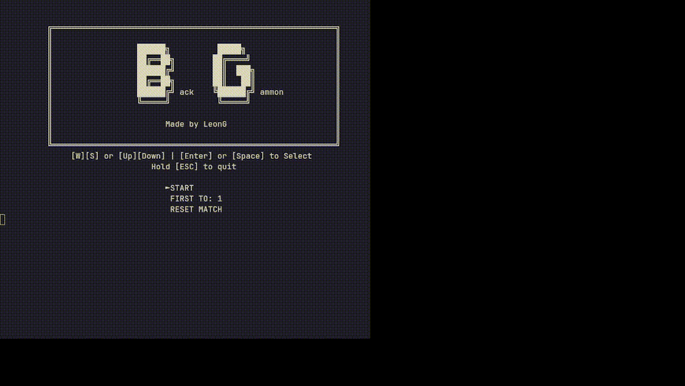

# Terminal Backgammon

A terminalbased implementation of the boardgame Backgammon.

## Screenshots

## Installation
1. Install python.
2. Clone this repo.
3. Open terminal and change into Backgammon directory.
4. Type: python3 main.py

## Technical solutions

### Recursive move validation.
The game uses a recursive function to make sure all dice are being played if possible.

### Undo.
The game stores the players moves and their consequences so that you are able to undo during your turn.

### Terminal rendering.
The game renders using text and ANSI-codes without the use of external libraries.

## Future Improvements
- Doubling cube.
- Save/load games.
- AI opponent.
- Game analysis.
- Color themes.

### About this project
This project was created as a way for me to deeper my understanding of:

- Object oriented programming.
- Python.
- Terminal rendering.
- Solving and finding edge cases.
- Datastructures.
